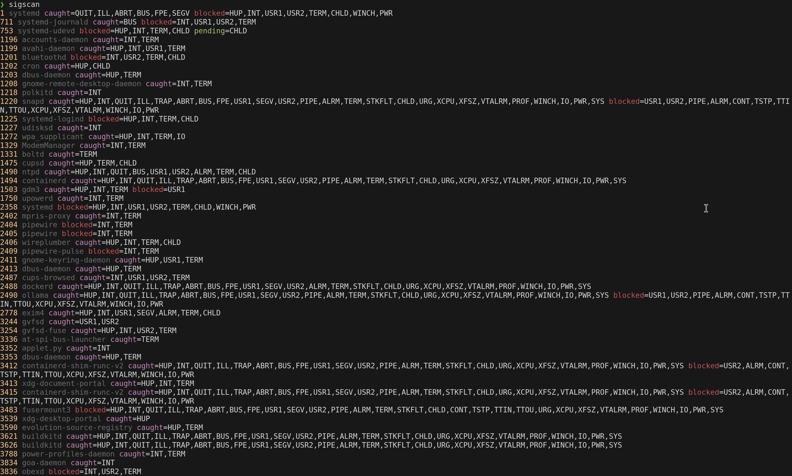

# Sigscan

List POSIX signal information for all processes.



## Features

* Easy to use (just `sigscan`)
* Blazingly fast (~95% of time spent in kernel space)
* Uses colors if output is detected as a terminal that supports them (or forcibly with `--(no-)colors`).

## Limitations

* Only classic POSIX signals are supported, no real-time signals.
* Relies on `/proc` and therefore only works on Linux.

## Installation

`sigscan` is available as a pre-compiled binaries or from source.

### Download Binaries

```bash
# Pick a download target
ARCH="x86_64" # or aarch64, riscv64gc
LIBC=gnu # or musl
TAG="latest"

# Download and install it
curl -L "https://github.com/brannondorsey/sigscan/releases/download/${TAG}/sigscan-${ARCH}-unknown-linux-${LIBC}.tar.gz" \
    | sudo tar xz -C /usr/local/bin/ \
    && sudo chmod +x /usr/local/bin/sigscan

# Verify installation
sigscan
```

### From Source

```bash
# Install rustup, if you don't already have it
curl --proto '=https' --tlsv1.2 -sSf https://sh.rustup.rs | sh

# Install sigscan
cargo install signal-scan

# Verify installation
sigscan
```

<!--
WARNING:
        THE "\#\# Examples" SECTION IS USED TO GENERATE THE EXAMPLE CONTENT
        DISPLAYED WHEN INVOKING `sigscan --examples`. ALL CONTENTENT AFTER
        THIS SECTION BUT BEFORE THE NEXT ## HEADER WILL BE AUTOMATICALLY
        INCLUDED IN THE `sigscan` BINARY.
-->
## Examples

### Basic usage

```bash
# Show all processes with caught, blocked, and pending signals (default)
sigscan

# Show only processes that are ignoring signals (omitted by default)
sigscan --ignored

# Show caught, blocked, pending, and ignored signals
sigscan --caught --blocked --pending --ignored

# The quivalent command using short argument notation
sigscan -cbpi
```

### Recipes

`sigscan` subscribes to the Unix philosophy of doing one thing and doing it well. It can be combined with other tools to answer more complex questions.

```bash
# Paginate out 
sigscan --color | less

# Get PIDs of processes that are blocking any type of signal
sigscan --blocked | cut -d" " -f1

# Find potential daemon processes (catching SIGHUP)
sigscan --caught | grep HUP | cut -d" " -f2

# Get the full command line of processes that are catching TERM
sigscan --caught | grep TERM | cut -d" " -f1 | xargs ps -o pid,cmd

# Find processes that might be zombies (blocking SIGCHLD)
sigscan --blocked | grep CHLD | awk '{print $1}' | xargs ps -o pid,ppid,state,cmd

# Continuously watch for processes with pending signals
watch --color -n 0.1 "sigscan --pending --color"
```

## Usage
<!--
/WARNING:
        END OF WARNING (SEE ABOVE)
-->

```txt
$ sigscan --help
List POSIX signal information for all processes.

By default -c (--caught), -b (--blocked), and -p (--pending) are set.
However, any of these options you specify will override and reset the defaults.

Example: sigscan -cbp

Note: This tool only supports classic POSIX signals, not real-time signals
(e.g. SIGRTMIN and above).

Usage: sigscan [OPTIONS]

Options:
  -i, --ignored
          Show processes that are ignoring signals

  -c, --caught
          Show processes that are catching signals

  -b, --blocked
          Show processes that are blocking signals

  -p, --pending
          Show processes that have pending signals

      --cmdline
          Replace the binary name with the full value of /proc/$PID/cmdline surrounded by quotes

      --color
          Force enable colored output (can also be set via FORCE_COLOR env var)

      --no-color
          Force disable colored output (can also be set via NO_COLOR env var)

      --examples
          Print the examples section from the README

  -h, --help
          Print help (see a summary with '-h')

  -V, --version
          Print version
```

## License

`sigscan` is dual-licensed under either of:

* [MIT license](https://opensource.org/license/mit)
* [Apache License, Version 2.0](https://opensource.org/license/apache-2-0)

at your option.

### Contribution

Unless you explicitly state otherwise, any contribution intentionally submitted
for inclusion in the work by you shall be dual licensed as above, without any
additional terms or conditions.
